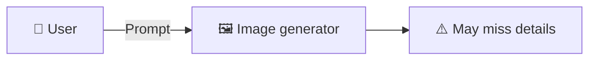
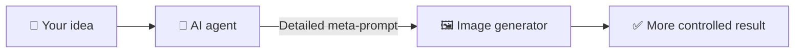

# OccMed ImageGen

<p align="center"><b>English</b> · <a href="docs/i18n/README.th.md">ภาษาไทย</a></p>

OccMed ImageGen is an open source set of agent skills for people working in occupational medicine and occupational health. It turns a short idea into an image for a poster, training session, presentation, or research project.

It makes images. It does not diagnose, treat, or decide whether someone is fit for work.

### Regular prompt vs meta-prompt

**Regular prompt**



**Meta-prompt**



A short prompt can leave important details open to chance. With meta-prompting, you describe what you need in everyday language and the agent turns it into a clear image brief—including layout, color, style, exact text, and anything that must stay out of the image.

### Why OpenRouter

<p align="center">
  <a href="https://openrouter.ai/">
    
  </a>
</p>

One [OpenRouter](https://openrouter.ai/) API key gives you access to image models from several providers. You can choose a fast model for drafts, a higher-fidelity model for final artwork, or a model that handles typography and reference images well—without setting up a separate API account for every provider.

These are strong current choices available through OpenRouter:

| Model | One OpenRouter key | Current OpenRouter price | Useful for |
| --- | :---: | --- | --- |
| [`openai/gpt-5.4-image-2`](https://openrouter.ai/openai/gpt-5.4-image-2) | ✅ | Image output: **$30 / 1M tokens** (about **฿1,009**) | Image generation combined with GPT-5.4 reasoning |
| [`google/gemini-3.1-flash-image-preview`](https://openrouter.ai/google/gemini-3.1-flash-image-preview) | ✅ | Image output: **$60 / 1M tokens** (about **฿2,018**) | Fast drafts, editing, and resolutions from 512 to 4K |
| [`google/gemini-3-pro-image-preview`](https://openrouter.ai/google/gemini-3-pro-image-preview) | ✅ | Image output: **$120 / 1M tokens** (about **฿4,036**) | Complex layouts, multilingual text, and 2K/4K work |
| [`x-ai/grok-imagine-image-quality`](https://openrouter.ai/x-ai/grok-imagine-image-quality) | ✅ | **$0.05 / 1K image** (about **฿1.68**) or **$0.07 / 2K image** (about **฿2.35**) | Photorealism, text in images, and reference-based edits |

Prices were checked on 29 July 2026 and use ฿33.6367 per US$1. Token-priced models charge according to the number of image-output tokens, so the cost of one image changes with size and model settings. Grok also charges $0.01 (about ฿0.34) for each input reference image. Check each linked OpenRouter model page before generating because models and prices can change.

Want to see which model is performing best now? Visit the independent [Arena text-to-image leaderboard](https://arena.ai/leaderboard/text-to-image), then use that model's OpenRouter slug in your request.

### Example images

All six posters carry the same hearing protection message. The first uses a general prompt. The other five show how extracted design systems can give the same content a completely different visual identity.

| General GPT Image 2 | Pop-art graffiti design | Children's storybook design |
| :---: | :---: | :---: |
| [](examples/generic-gpt-image-2-hearing-protection-poster.webp) | [](examples/pop-art-graffiti-design-guided-hearing-protection-poster.webp) | [](examples/childrens-storybook-design-guided-hearing-protection-poster.webp) |
| About ฿1.45 | About ฿1.45 | About ฿1.45 |

| Layered papercraft design | Cute 3D cat design | Pixel-art kaiju design |
| :---: | :---: | :---: |
| [](examples/papercraft-design-guided-hearing-protection-poster.webp) | [](examples/cute-3d-cat-design-guided-hearing-protection-poster.webp) | [](examples/pixel-art-kaiju-design-guided-hearing-protection-poster.webp) |
| $0.133 · about ฿4.47 | $0.132 · about ฿4.44 | $0.132 · about ฿4.44 |

> These images came from AI. Check the medical, safety, and legal details before using them.

The first row used `openai/gpt-image-2` at `medium` quality with a `9:16` aspect ratio and one output. Its estimated price is about US$0.043, or ฿1.45, per image. The second row shows the actual generation costs supplied with those images. The final OpenRouter charge can change with prompt length, reference images, model pricing, settings, and the exchange rate.

### Pay for the images you make

You do not need a paid ChatGPT subscription to run these skills through OpenRouter. OpenRouter charges for each API generation. A ChatGPT subscription includes many other services, so this is a useful cost check rather than a like-for-like comparison.

| ChatGPT plan | Published US price | Approximate monthly price in Thai baht | Published image access | Same spend at ฿1.45 per image |
| --- | ---: | ---: | --- | ---: |
| Free | $0 | ฿0 | Limited and slower | Not compared because it is free |
| Go | $8/month | About ฿269/month | More than Free; no fixed public image quota | About 185 images |
| Plus | $20/month | About ฿673/month | More complex and accurate creation; limits apply | About 464 images |
| Pro | $200/month | About ฿6,727/month | Unlimited and faster, subject to abuse guardrails | About 4,639 images |

The baht figures use the Bank of Thailand's USD transfer rate from 24 July 2026, ฿33.6367 per US$1. They do not include tax, card fees, or regional pricing. Check [ChatGPT plan pricing](https://chatgpt.com/pricing/), [OpenAI's Go, Plus, and Pro announcement](https://openai.com/index/introducing-chatgpt-go/), [OpenAI image model pricing](https://developers.openai.com/api/docs/pricing#image-generation), and [Bank of Thailand exchange rates](https://www.bot.or.th/en/statistics/financial-institutions/exchange-rate.html) for current figures.

### What you can control

| Control | Available settings |
| --- | --- |
| Aspect ratio | `1:1`, `3:2`, `2:3`, `4:3`, `3:4`, `16:9`, `9:16`, `21:9`, or automatic |
| Image size | Pick the layout and aspect ratio; the model chooses the native pixel count. The examples on this page are 864×1536. You can resize or crop locally when you need exact delivery dimensions. |
| Quality and cost | `low`, `medium`, `high`, or automatic |
| Visual direction | Subject, action, layout, art style, palette, lighting, viewpoint, mood, and exclusions |
| Text in the image | Exact wording, language, hierarchy, labels, and placement |
| Reference images | Use up to 16 images to guide identity, product shape, composition, or style |
| Number of images | Generate 1–10 images in one request |
| Delivery | PNG or JPEG, JPEG compression, and automatic or opaque background |

A short request is enough:

```text
Create a 9:16 hearing protection poster for factory workers. Use medium quality
and a warm children's storybook style. Use this exact headline:
"Protect Your Hearing Every Day". Show correct earmuff placement.
Do not use identifiable people or company branding. Deliver one PNG image.
```

### Skills in this repository

| Skill | What it does |
| --- | --- |
| [`extract-image-design`](skills/extract-image-design/) | Pulls the palette, layout, typography, and style from a reference image, then saves them as JSON and Markdown for reuse. The source image stays on your machine during extraction. |
| [`metaprompt-image-generation`](skills/metaprompt-image-generation/) | Turns a rough brief into a working prompt, then creates or edits images through OpenRouter. It uses `openai/gpt-image-2` by default. |

Each folder has its own `SKILL.md`, agent metadata, scripts, and reference notes. The image generation skill also has an offline test suite.

### Install for Codex

You need:

- Python 3.9 or newer
- Git
- An OpenRouter API key, used only when you generate an image

Clone the repository and copy both skills into your Codex skills directory:

```bash
git clone https://github.com/taewat07/OccMed-ImageGen.git
mkdir -p ~/.codex/skills
cp -R OccMed-ImageGen/skills/extract-image-design ~/.codex/skills/
cp -R OccMed-ImageGen/skills/metaprompt-image-generation ~/.codex/skills/
```

Install the image runner dependency:

```bash
python3 -m pip install -r ~/.codex/skills/metaprompt-image-generation/requirements.txt
```

Create the local OpenRouter settings file:

```bash
python3 ~/.codex/skills/metaprompt-image-generation/scripts/openrouter_image.py init
```

Open `~/.codex/skills/metaprompt-image-generation/.env` and add your API key:

```dotenv
OPENROUTER_API_KEY=your_key_here
```

Git ignores `.env`. Do not put an API key in a chat, prompt, issue, or commit.

### Use the skills

Extract a reusable design system from a local reference image:

```text
Use $extract-image-design to extract this image into a reusable design catalog entry.
```

Create an occupational health image:

```text
Use $metaprompt-image-generation to create a 16:9 training image explaining
correct hearing-protection use in a manufacturing workplace.
Use no identifiable workers or company branding.
```

If the aspect ratio, image count, or quality is missing, the agent asks for it. It then writes the prompt, sends the request to OpenRouter, and checks the returned image when visual inspection is available.

### Privacy, safety, and cost

- Do not submit information that can identify a patient, worker, employer, or workplace. Keep confidential workplace data out of the prompt.
- Remove names, faces, dates, ID numbers, badges, facility names, and metadata before sending anything to AI.
- `extract-image-design` reads accessible local images without uploading them. `metaprompt-image-generation` sends prompts and supplied reference images to OpenRouter and the model provider.
- Check every image. AI can produce incorrect text, unsafe work practices, stereotypes, or misleading medical content.
- These skills are not medical devices. They do not replace professional judgment, local law, or workplace safety procedures.
- OpenRouter and its model providers may charge for requests and keep data under their own terms. Read those terms before sending workplace material.

### Development

Run the offline image runner tests:

```bash
python3 -m unittest discover -s skills/metaprompt-image-generation/tests -p 'test_*.py'
```

Inspect the command line tools:

```bash
python3 skills/extract-image-design/scripts/design_catalog.py --help
python3 skills/metaprompt-image-generation/scripts/openrouter_image.py --help
```

### License

Released under the [MIT License](LICENSE).
