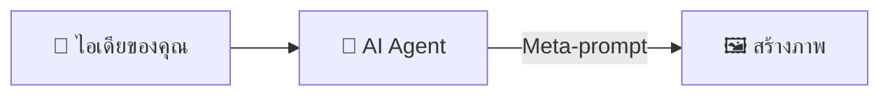
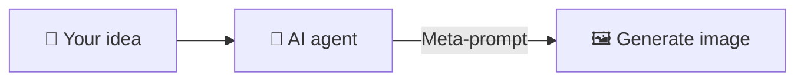

# OccMed ImageGen

[ภาษาไทย](#thai) | [English](#english)

<a id="thai"></a>

## ภาษาไทย

ชุดทักษะเอเจนต์แบบโอเพนซอร์สสำหรับบุคลากรอาชีวเวชศาสตร์และอาชีวอนามัย ช่วยเปลี่ยนไอเดียสั้น ๆ ให้เป็นภาพสำหรับโปสเตอร์ สื่ออบรม งานนำเสนอ และงานวิจัย

เครื่องมือนี้ช่วยทำภาพ ไม่ได้ใช้วินิจฉัยโรค รักษาโรค หรือประเมินความพร้อมในการทำงาน

### Meta-prompt ทำงานอย่างไร



คุณบอกสิ่งที่อยากได้แบบภาษาคนทั่วไป เอเจนต์จะเรียบเรียงรายละเอียดที่จำเป็นให้โมเดลสร้างภาพ เช่น องค์ประกอบภาพ สี สไตล์ ข้อความที่ต้องปรากฏ และสิ่งที่ไม่ควรอยู่ในภาพ

### ตัวอย่างภาพ

ทั้งสามภาพสื่อเรื่องการป้องกันเสียงดังเหมือนกัน ภาพแรกใช้คำสั่งทั่วไป ส่วนอีกสองภาพใช้ระบบงานออกแบบที่สกัดจากภาพอ้างอิง

| GPT Image 2 แบบทั่วไป | ใช้ดีไซน์ pop-art graffiti | ใช้ดีไซน์หนังสือนิทานเด็ก |
| :---: | :---: | :---: |
| [](examples/generic-gpt-image-2-hearing-protection-poster.webp) | [](examples/pop-art-graffiti-design-guided-hearing-protection-poster.webp) | [](examples/childrens-storybook-design-guided-hearing-protection-poster.webp) |
| ประมาณ ฿1.45 | ประมาณ ฿1.45 | ประมาณ ฿1.45 |

> ภาพเหล่านี้เป็นตัวอย่างจาก AI ควรตรวจความถูกต้องทางการแพทย์ ความปลอดภัย และกฎหมายก่อนนำไปใช้จริง

ทั้งสามภาพสร้างด้วย `openai/gpt-image-2` คุณภาพ `medium` อัตราส่วน `9:16` ครั้งละหนึ่งภาพ ราคาประเมินอยู่ที่ประมาณ US$0.043 หรือ ฿1.45 ต่อภาพ ค่าใช้จ่ายจริงอาจต่างออกไปเล็กน้อยตามความยาวของ prompt จำนวนภาพอ้างอิง ราคาของโมเดล และอัตราแลกเปลี่ยน

### จ่ายตามจำนวนภาพที่สร้าง

การใช้ชุดทักษะนี้ผ่าน OpenRouter ไม่จำเป็นต้องสมัคร ChatGPT แบบเสียเงิน เพราะ OpenRouter คิดค่าบริการตามจำนวนภาพที่สร้าง ส่วนค่าสมัคร ChatGPT รวมบริการอื่นไว้ด้วย จึงไม่ใช่สินค้าแบบเดียวกันเสียทีเดียว

| แพ็กเกจ ChatGPT | ราคาที่ประกาศ | คิดเป็นเงินบาทโดยประมาณต่อเดือน | สิทธิ์สร้างภาพที่ประกาศไว้ | งบเท่ากันสร้างภาพราคา ฿1.45 ได้ประมาณ |
| --- | ---: | ---: | --- | ---: |
| Free | $0 | ฿0 | จำกัดจำนวนและช้ากว่า | ไม่คิดเทียบ เพราะใช้ฟรี |
| Go | $8/เดือน | ฿269/เดือน | มากกว่า Free แต่ไม่ได้ประกาศจำนวนภาพตายตัว | 185 ภาพ |
| Plus | $20/เดือน | ฿673/เดือน | สร้างงานซับซ้อนได้ดีขึ้น แต่ยังมีขีดจำกัด | 464 ภาพ |
| Pro | $200/เดือน | ฿6,727/เดือน | ไม่จำกัดและเร็วกว่า ภายใต้ข้อกำหนดป้องกันการใช้งานผิดประเภท | 4,639 ภาพ |

ตัวเลขเงินบาทใช้อัตราซื้อเงินโอนของธนาคารแห่งประเทศไทยวันที่ 24 กรกฎาคม 2569 ที่ ฿33.6367 ต่อ US$1 ยังไม่รวมภาษี ค่าธรรมเนียมบัตร หรือราคาเฉพาะประเทศ ตรวจข้อมูลล่าสุดได้จาก [ราคาแพ็กเกจ ChatGPT](https://chatgpt.com/pricing/), [ประกาศราคา Go, Plus และ Pro](https://openai.com/index/introducing-chatgpt-go/), [ราคาโมเดลสร้างภาพของ OpenAI](https://developers.openai.com/api/docs/pricing#image-generation) และ [อัตราแลกเปลี่ยนของธนาคารแห่งประเทศไทย](https://www.bot.or.th/en/statistics/financial-institutions/exchange-rate.html)

### ปรับอะไรได้บ้าง

| สิ่งที่ปรับได้ | รายละเอียด |
| --- | --- |
| อัตราส่วนภาพ | `1:1`, `3:2`, `2:3`, `4:3`, `3:4`, `16:9`, `9:16`, `21:9` หรือให้โมเดลเลือก |
| ขนาดภาพ | เลือกแนวตั้ง แนวนอน และอัตราส่วนได้ โมเดลจะกำหนดจำนวนพิกเซล ภาพตัวอย่างในหน้านี้มีขนาด 864×1536 พิกเซล หากต้องการขนาดตายตัว สามารถย่อ ขยาย หรือตัดภาพในเครื่องภายหลังได้ |
| คุณภาพและราคา | `low`, `medium`, `high` หรือให้โมเดลเลือก |
| หน้าตาของภาพ | กำหนดเรื่องราว การจัดวาง สไตล์ สี แสง มุมมอง อารมณ์ และสิ่งที่ห้ามปรากฏได้ |
| ข้อความในภาพ | ระบุหัวเรื่อง ป้ายกำกับ ภาษา ลำดับความสำคัญ และตำแหน่งข้อความได้ |
| ภาพอ้างอิง | ใช้ได้สูงสุด 16 ภาพ เพื่อควบคุมตัวบุคคล รูปทรงผลิตภัณฑ์ องค์ประกอบ หรือสไตล์ |
| จำนวนภาพ | สร้างได้ 1–10 ภาพต่อคำขอ |
| ไฟล์ที่ส่งมอบ | เลือก PNG หรือ JPEG ปรับการบีบอัด JPEG และเลือกพื้นหลังแบบอัตโนมัติหรือทึบแสงได้ |

ตัวอย่างคำสั่งแบบสั้น:

```text
ทำโปสเตอร์แนวตั้ง 9:16 เรื่องการป้องกันเสียงดังสำหรับคนงานโรงงาน
ใช้คุณภาพ medium และสไตล์หนังสือนิทานเด็ก โทนสีอบอุ่น
ใส่หัวเรื่องว่า "Protect Your Hearing Every Day"
แสดงวิธีใส่ที่ครอบหูให้ถูกต้อง ไม่ใช้ใบหน้าบุคคลจริงหรือโลโก้บริษัท
ส่งเป็นไฟล์ PNG จำนวน 1 ภาพ
```

### Skills ที่มีใน repo

| Skill | ใช้ทำอะไร |
| --- | --- |
| [`extract-image-design`](skills/extract-image-design/) | จับสี เลย์เอาต์ ตัวอักษร และสไตล์จากภาพอ้างอิง แล้วบันทึกเป็น JSON และ Markdown เพื่อนำไปใช้กับภาพใหม่ ภาพต้นฉบับยังอยู่ในเครื่องระหว่างขั้นตอนนี้ |
| [`metaprompt-image-generation`](skills/metaprompt-image-generation/) | เปลี่ยนโจทย์สั้น ๆ เป็น prompt พร้อมใช้งาน แล้วสร้างหรือแก้ภาพผ่าน OpenRouter ค่าเริ่มต้นใช้โมเดล `openai/gpt-image-2` |

แต่ละโฟลเดอร์มี `SKILL.md`, ข้อมูลเอเจนต์ สคริปต์ และเอกสารประกอบ ส่วน skill สร้างภาพมีชุดทดสอบที่รันได้โดยไม่เรียก API

### ติดตั้งกับ Codex

สิ่งที่ต้องมี:

- Python 3.9 ขึ้นไป
- Git
- OpenRouter API key ใช้เฉพาะตอนสร้างภาพ

ดาวน์โหลด repo แล้วคัดลอกทั้งสอง skill ไปยังโฟลเดอร์ skills ของ Codex:

```bash
git clone https://github.com/taewat07/OccMed-ImageGen.git
mkdir -p ~/.codex/skills
cp -R OccMed-ImageGen/skills/extract-image-design ~/.codex/skills/
cp -R OccMed-ImageGen/skills/metaprompt-image-generation ~/.codex/skills/
```

ติดตั้งแพ็กเกจที่ใช้ส่งคำขอสร้างภาพ:

```bash
python3 -m pip install -r ~/.codex/skills/metaprompt-image-generation/requirements.txt
```

สร้างไฟล์ตั้งค่าสำหรับ OpenRouter:

```bash
python3 ~/.codex/skills/metaprompt-image-generation/scripts/openrouter_image.py init
```

เปิดไฟล์ `~/.codex/skills/metaprompt-image-generation/.env` แล้วใส่ API key:

```dotenv
OPENROUTER_API_KEY=your_key_here
```

Git จะไม่ติดตามไฟล์ `.env` อย่าวาง API key ในแชต prompt issue หรือ commit

### วิธีใช้

สกัดระบบงานออกแบบจากภาพอ้างอิงที่อยู่ในเครื่อง:

```text
Use $extract-image-design to extract this image into a reusable design catalog entry.
```

สร้างภาพสำหรับงานอาชีวอนามัย:

```text
Use $metaprompt-image-generation to create a 16:9 training image explaining
correct hearing-protection use in a manufacturing workplace.
Use no identifiable workers or company branding.
```

ถ้ายังไม่รู้สัดส่วน จำนวนภาพ หรือระดับคุณภาพ เอเจนต์จะถามเพิ่มเท่าที่จำเป็น จากนั้นจึงเขียน prompt ส่งคำขอไปยัง OpenRouter และตรวจภาพเมื่อระบบรองรับการดูภาพ

### ความเป็นส่วนตัว ความปลอดภัย และค่าใช้จ่าย

- ห้ามส่งข้อมูลที่ระบุตัวผู้ป่วย พนักงาน นายจ้าง หรือสถานประกอบการได้ รวมถึงข้อมูลลับในที่ทำงาน
- ลบชื่อ ใบหน้า วันที่ เลขประจำตัว ป้ายพนักงาน ชื่อสถานที่ และ metadata ก่อนส่งข้อมูลให้ AI
- `extract-image-design` อ่านภาพในเครื่องโดยไม่อัปโหลด ส่วน `metaprompt-image-generation` จะส่ง prompt และภาพอ้างอิงไปยัง OpenRouter และผู้ให้บริการโมเดล
- ตรวจภาพทุกครั้ง เพราะ AI อาจสร้างข้อความผิด ขั้นตอนการทำงานที่ไม่ปลอดภัย ภาพเหมารวม หรือเนื้อหาทางการแพทย์ที่ชวนให้เข้าใจผิด
- Skills เหล่านี้ไม่ใช่เครื่องมือแพทย์ และใช้แทนวิจารณญาณของผู้ประกอบวิชาชีพ กฎหมาย หรือขั้นตอนความปลอดภัยของสถานประกอบการไม่ได้
- OpenRouter และผู้ให้บริการโมเดลอาจคิดค่าบริการและมีนโยบายเก็บข้อมูลต่างกัน ควรอ่านเงื่อนไขก่อนส่งข้อมูลงาน

### สำหรับนักพัฒนา

รันชุดทดสอบของ image runner:

```bash
python3 -m unittest discover -s skills/metaprompt-image-generation/tests -p 'test_*.py'
```

ดูคำสั่งของ CLI:

```bash
python3 skills/extract-image-design/scripts/design_catalog.py --help
python3 skills/metaprompt-image-generation/scripts/openrouter_image.py --help
```

### License

เผยแพร่ภายใต้ [MIT License](LICENSE)

---

<a id="english"></a>

## English

OccMed ImageGen is an open source set of agent skills for people working in occupational medicine and occupational health. It turns a short idea into an image for a poster, training session, presentation, or research project.

It makes images. It does not diagnose, treat, or decide whether someone is fit for work.

### How meta-prompting works



Describe what you need in everyday language. The agent fills in the details the image model needs, including layout, color, style, exact text, and anything that must stay out of the image.

### Example images

All three posters carry the same hearing protection message. The first uses a general prompt. The other two use design systems extracted from reference images.

| General GPT Image 2 | Pop-art graffiti design | Children's storybook design |
| :---: | :---: | :---: |
| [](examples/generic-gpt-image-2-hearing-protection-poster.webp) | [](examples/pop-art-graffiti-design-guided-hearing-protection-poster.webp) | [](examples/childrens-storybook-design-guided-hearing-protection-poster.webp) |
| About ฿1.45 | About ฿1.45 | About ฿1.45 |

> These images came from AI. Check the medical, safety, and legal details before using them.

Each example used `openai/gpt-image-2` at `medium` quality with a `9:16` aspect ratio and one output. The estimated price is about US$0.043, or ฿1.45, per image. The final OpenRouter charge can change slightly with prompt length, reference images, model pricing, and the exchange rate.

### Pay for the images you make

You do not need a paid ChatGPT subscription to run these skills through OpenRouter. OpenRouter charges for each API generation. A ChatGPT subscription includes many other services, so this is a useful cost check rather than a like-for-like comparison.

| ChatGPT plan | Published US price | Approximate monthly price in Thai baht | Published image access | Same spend at ฿1.45 per image |
| --- | ---: | ---: | --- | ---: |
| Free | $0 | ฿0 | Limited and slower | Not compared because it is free |
| Go | $8/month | About ฿269/month | More than Free; no fixed public image quota | About 185 images |
| Plus | $20/month | About ฿673/month | More complex and accurate creation; limits apply | About 464 images |
| Pro | $200/month | About ฿6,727/month | Unlimited and faster, subject to abuse guardrails | About 4,639 images |

The baht figures use the Bank of Thailand's USD transfer rate from 24 July 2026, ฿33.6367 per US$1. They do not include tax, card fees, or regional pricing. Check [ChatGPT plan pricing](https://chatgpt.com/pricing/), [OpenAI's Go, Plus, and Pro announcement](https://openai.com/index/introducing-chatgpt-go/), [OpenAI image model pricing](https://developers.openai.com/api/docs/pricing#image-generation), and [Bank of Thailand exchange rates](https://www.bot.or.th/en/statistics/financial-institutions/exchange-rate.html) for current figures.

### What you can control

| Control | Available settings |
| --- | --- |
| Aspect ratio | `1:1`, `3:2`, `2:3`, `4:3`, `3:4`, `16:9`, `9:16`, `21:9`, or automatic |
| Image size | Pick the layout and aspect ratio; the model chooses the native pixel count. The examples on this page are 864×1536. You can resize or crop locally when you need exact delivery dimensions. |
| Quality and cost | `low`, `medium`, `high`, or automatic |
| Visual direction | Subject, action, layout, art style, palette, lighting, viewpoint, mood, and exclusions |
| Text in the image | Exact wording, language, hierarchy, labels, and placement |
| Reference images | Use up to 16 images to guide identity, product shape, composition, or style |
| Number of images | Generate 1–10 images in one request |
| Delivery | PNG or JPEG, JPEG compression, and automatic or opaque background |

A short request is enough:

```text
Create a 9:16 hearing protection poster for factory workers. Use medium quality
and a warm children's storybook style. Use this exact headline:
"Protect Your Hearing Every Day". Show correct earmuff placement.
Do not use identifiable people or company branding. Deliver one PNG image.
```

### Skills in this repository

| Skill | What it does |
| --- | --- |
| [`extract-image-design`](skills/extract-image-design/) | Pulls the palette, layout, typography, and style from a reference image, then saves them as JSON and Markdown for reuse. The source image stays on your machine during extraction. |
| [`metaprompt-image-generation`](skills/metaprompt-image-generation/) | Turns a rough brief into a working prompt, then creates or edits images through OpenRouter. It uses `openai/gpt-image-2` by default. |

Each folder has its own `SKILL.md`, agent metadata, scripts, and reference notes. The image generation skill also has an offline test suite.

### Install for Codex

You need:

- Python 3.9 or newer
- Git
- An OpenRouter API key, used only when you generate an image

Clone the repository and copy both skills into your Codex skills directory:

```bash
git clone https://github.com/taewat07/OccMed-ImageGen.git
mkdir -p ~/.codex/skills
cp -R OccMed-ImageGen/skills/extract-image-design ~/.codex/skills/
cp -R OccMed-ImageGen/skills/metaprompt-image-generation ~/.codex/skills/
```

Install the image runner dependency:

```bash
python3 -m pip install -r ~/.codex/skills/metaprompt-image-generation/requirements.txt
```

Create the local OpenRouter settings file:

```bash
python3 ~/.codex/skills/metaprompt-image-generation/scripts/openrouter_image.py init
```

Open `~/.codex/skills/metaprompt-image-generation/.env` and add your API key:

```dotenv
OPENROUTER_API_KEY=your_key_here
```

Git ignores `.env`. Do not put an API key in a chat, prompt, issue, or commit.

### Use the skills

Extract a reusable design system from a local reference image:

```text
Use $extract-image-design to extract this image into a reusable design catalog entry.
```

Create an occupational health image:

```text
Use $metaprompt-image-generation to create a 16:9 training image explaining
correct hearing-protection use in a manufacturing workplace.
Use no identifiable workers or company branding.
```

If the aspect ratio, image count, or quality is missing, the agent asks for it. It then writes the prompt, sends the request to OpenRouter, and checks the returned image when visual inspection is available.

### Privacy, safety, and cost

- Do not submit information that can identify a patient, worker, employer, or workplace. Keep confidential workplace data out of the prompt.
- Remove names, faces, dates, ID numbers, badges, facility names, and metadata before sending anything to AI.
- `extract-image-design` reads accessible local images without uploading them. `metaprompt-image-generation` sends prompts and supplied reference images to OpenRouter and the model provider.
- Check every image. AI can produce incorrect text, unsafe work practices, stereotypes, or misleading medical content.
- These skills are not medical devices. They do not replace professional judgment, local law, or workplace safety procedures.
- OpenRouter and its model providers may charge for requests and keep data under their own terms. Read those terms before sending workplace material.

### Development

Run the offline image runner tests:

```bash
python3 -m unittest discover -s skills/metaprompt-image-generation/tests -p 'test_*.py'
```

Inspect the command line tools:

```bash
python3 skills/extract-image-design/scripts/design_catalog.py --help
python3 skills/metaprompt-image-generation/scripts/openrouter_image.py --help
```

### License

Released under the [MIT License](LICENSE).
