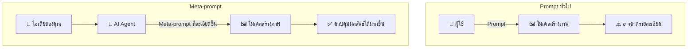
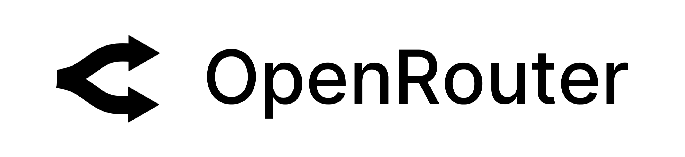
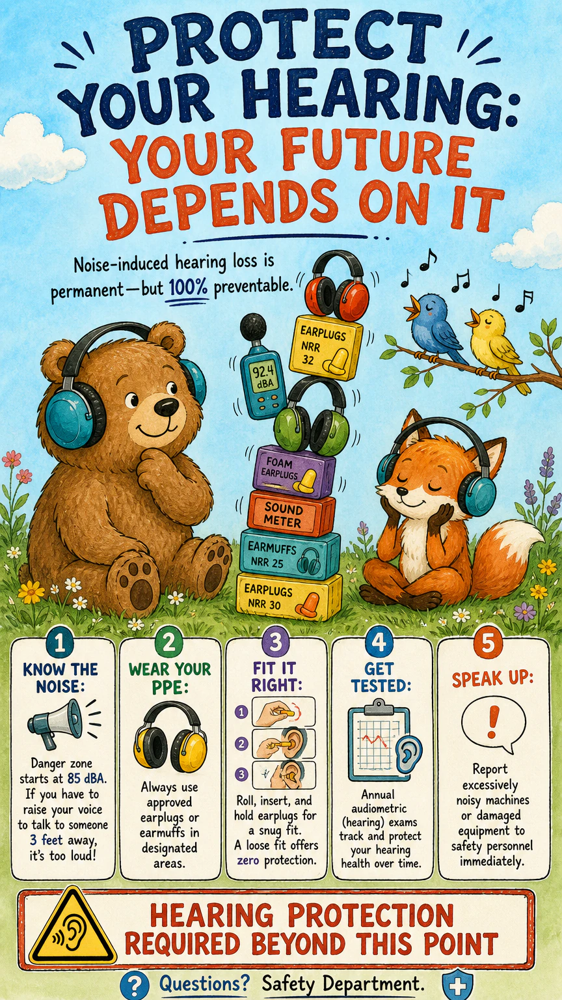

# OccMed ImageGen

<p align="center"><a href="../../README.md">English</a> · <b>ภาษาไทย</b></p>

ชุดทักษะเอเจนต์แบบโอเพนซอร์สสำหรับบุคลากรอาชีวเวชศาสตร์และอาชีวอนามัย ช่วยเปลี่ยนไอเดียสั้น ๆ ให้เป็นภาพสำหรับโปสเตอร์ สื่ออบรม งานนำเสนอ และงานวิจัย

เครื่องมือนี้ช่วยทำภาพ ไม่ได้ใช้วินิจฉัยโรค รักษาโรค หรือประเมินความพร้อมในการทำงาน

### Prompt ทั่วไป เทียบกับ Meta-prompt



Prompt สั้น ๆ อาจเปิดช่องให้โมเดลเดารายละเอียดสำคัญเอง แต่เมื่อใช้ Meta-prompt คุณเพียงบอกสิ่งที่ต้องการด้วยภาษาทั่วไป แล้วเอเจนต์จะเรียบเรียงเป็นโจทย์สร้างภาพที่ชัดเจน ทั้งองค์ประกอบ สี สไตล์ ข้อความที่ต้องปรากฏ และสิ่งที่ไม่ควรอยู่ในภาพ

### ทำไมจึงเลือก OpenRouter

<p align="center">
  <a href="https://openrouter.ai/">
    
  </a>
</p>

[OpenRouter](https://openrouter.ai/) ใช้ API key เพียงอันเดียวก็เข้าถึงโมเดลสร้างภาพจากผู้ให้บริการหลายรายได้ งานร่างที่เน้นความเร็ว งานจริงที่ต้องการรายละเอียดสูง หรืองานที่มีตัวอักษรและภาพอ้างอิง จึงเลือกโมเดลให้เหมาะกับงานได้โดยไม่ต้องเปิดบัญชี API แยกหลายแห่ง

ตัวอย่างโมเดลชั้นนำที่ใช้งานผ่าน OpenRouter ได้ในปัจจุบัน:

| โมเดล | ใช้ OpenRouter key เดียว | ราคาปัจจุบันบน OpenRouter | เหมาะกับงาน |
| --- | :---: | --- | --- |
| [`openai/gpt-5.4-image-2`](https://openrouter.ai/openai/gpt-5.4-image-2) | ✅ | ผลลัพธ์ภาพ **$30 / 1 ล้าน tokens** (ประมาณ **฿1,009**) | สร้างภาพร่วมกับการให้เหตุผลของ GPT-5.4 |
| [`google/gemini-3.1-flash-image-preview`](https://openrouter.ai/google/gemini-3.1-flash-image-preview) | ✅ | ผลลัพธ์ภาพ **$60 / 1 ล้าน tokens** (ประมาณ **฿2,018**) | ร่างภาพเร็ว แก้ภาพ และเลือกความละเอียด 512 ถึง 4K |
| [`google/gemini-3-pro-image-preview`](https://openrouter.ai/google/gemini-3-pro-image-preview) | ✅ | ผลลัพธ์ภาพ **$120 / 1 ล้าน tokens** (ประมาณ **฿4,036**) | เลย์เอาต์ซับซ้อน ตัวอักษรหลายภาษา และงาน 2K/4K |
| [`x-ai/grok-imagine-image-quality`](https://openrouter.ai/x-ai/grok-imagine-image-quality) | ✅ | **$0.05 / ภาพ 1K** (ประมาณ **฿1.68**) หรือ **$0.07 / ภาพ 2K** (ประมาณ **฿2.35**) | ภาพสมจริง ตัวอักษรในภาพ และการแก้ภาพจากภาพอ้างอิง |

ตรวจราคาเมื่อ 29 กรกฎาคม 2569 โดยคิดที่ ฿33.6367 ต่อ US$1 โมเดลที่คิดราคาตาม token จะมีราคาต่อภาพต่างกันตามขนาดและการตั้งค่า ส่วน Grok คิดค่าภาพอ้างอิงเพิ่มภาพละ $0.01 หรือประมาณ ฿0.34 โมเดลและราคาเปลี่ยนแปลงได้ ควรตรวจหน้า OpenRouter ของแต่ละโมเดลก่อนสร้างภาพ

หากต้องการดูว่าโมเดลใดทำผลงานได้ดีที่สุดในขณะนี้ ให้เปิด [ตารางอันดับ Text-to-Image ของ Arena](https://arena.ai/leaderboard/text-to-image) แล้วนำชื่อโมเดลบน OpenRouter มาใช้กับคำสั่งของคุณ

### ตัวอย่างภาพ

ทั้งสามภาพสื่อเรื่องการป้องกันเสียงดังเหมือนกัน ภาพแรกใช้คำสั่งทั่วไป ส่วนอีกสองภาพใช้ระบบงานออกแบบที่สกัดจากภาพอ้างอิง

| GPT Image 2 แบบทั่วไป | ใช้ดีไซน์ pop-art graffiti | ใช้ดีไซน์หนังสือนิทานเด็ก |
| :---: | :---: | :---: |
| [](../../examples/generic-gpt-image-2-hearing-protection-poster.webp) | [](../../examples/pop-art-graffiti-design-guided-hearing-protection-poster.webp) | [](../../examples/childrens-storybook-design-guided-hearing-protection-poster.webp) |
| ประมาณ ฿1.45 | ประมาณ ฿1.45 | ประมาณ ฿1.45 |

> ภาพเหล่านี้เป็นตัวอย่างจาก AI ควรตรวจความถูกต้องทางการแพทย์ ความปลอดภัย และกฎหมายก่อนนำไปใช้จริง

ทั้งสามภาพสร้างด้วย `openai/gpt-image-2` คุณภาพ `medium` อัตราส่วน `9:16` ครั้งละหนึ่งภาพ ราคาประเมินอยู่ที่ประมาณ US$0.043 หรือ ฿1.45 ต่อภาพ ค่าใช้จ่ายจริงอาจต่างออกไปเล็กน้อยตามความยาวของ prompt จำนวนภาพอ้างอิง ราคาของโมเดล และอัตราแลกเปลี่ยน

### จ่ายตามจำนวนภาพที่สร้าง

การใช้ชุดทักษะนี้ผ่าน OpenRouter ไม่จำเป็นต้องสมัคร ChatGPT แบบเสียเงิน เพราะ OpenRouter คิดค่าบริการตามจำนวนภาพที่สร้าง ส่วนค่าสมัคร ChatGPT รวมบริการอื่นไว้ด้วย จึงไม่ใช่สินค้าแบบเดียวกันเสียทีเดียว

| แพ็กเกจ ChatGPT | ราคาที่ประกาศ | คิดเป็นเงินบาทโดยประมาณต่อเดือน | สิทธิ์สร้างภาพที่ประกาศไว้ | งบเท่ากันสร้างภาพราคา ฿1.45 ได้ประมาณ |
| --- | ---: | ---: | --- | ---: |
| Free | $0 | ฿0 | จำกัดจำนวนและช้ากว่า | ไม่คิดเทียบ เพราะใช้ฟรี |
| Go | $8/เดือน | ฿269/เดือน | มากกว่า Free แต่ไม่ได้ประกาศจำนวนภาพตายตัว | 185 ภาพ |
| Plus | $20/เดือน | ฿673/เดือน | สร้างงานซับซ้อนได้ดีขึ้น แต่ยังมีขีดจำกัด | 464 ภาพ |
| Pro | $200/เดือน | ฿6,727/เดือน | ไม่จำกัดและเร็วกว่า ภายใต้ข้อกำหนดป้องกันการใช้งานผิดประเภท | 4,639 ภาพ |

ตัวเลขเงินบาทใช้อัตราซื้อเงินโอนของธนาคารแห่งประเทศไทยวันที่ 24 กรกฎาคม 2569 ที่ ฿33.6367 ต่อ US$1 ยังไม่รวมภาษี ค่าธรรมเนียมบัตร หรือราคาเฉพาะประเทศ ตรวจข้อมูลล่าสุดได้จาก [ราคาแพ็กเกจ ChatGPT](https://chatgpt.com/pricing/), [ประกาศราคา Go, Plus และ Pro](https://openai.com/index/introducing-chatgpt-go/), [ราคาโมเดลสร้างภาพของ OpenAI](https://developers.openai.com/api/docs/pricing#image-generation) และ [อัตราแลกเปลี่ยนของธนาคารแห่งประเทศไทย](https://www.bot.or.th/en/statistics/financial-institutions/exchange-rate.html)

### ปรับอะไรได้บ้าง

| สิ่งที่ปรับได้ | รายละเอียด |
| --- | --- |
| อัตราส่วนภาพ | `1:1`, `3:2`, `2:3`, `4:3`, `3:4`, `16:9`, `9:16`, `21:9` หรือให้โมเดลเลือก |
| ขนาดภาพ | เลือกแนวตั้ง แนวนอน และอัตราส่วนได้ โมเดลจะกำหนดจำนวนพิกเซล ภาพตัวอย่างในหน้านี้มีขนาด 864×1536 พิกเซล หากต้องการขนาดตายตัว สามารถย่อ ขยาย หรือตัดภาพในเครื่องภายหลังได้ |
| คุณภาพและราคา | `low`, `medium`, `high` หรือให้โมเดลเลือก |
| หน้าตาของภาพ | กำหนดเรื่องราว การจัดวาง สไตล์ สี แสง มุมมอง อารมณ์ และสิ่งที่ห้ามปรากฏได้ |
| ข้อความในภาพ | ระบุหัวเรื่อง ป้ายกำกับ ภาษา ลำดับความสำคัญ และตำแหน่งข้อความได้ |
| ภาพอ้างอิง | ใช้ได้สูงสุด 16 ภาพ เพื่อควบคุมตัวบุคคล รูปทรงผลิตภัณฑ์ องค์ประกอบ หรือสไตล์ |
| จำนวนภาพ | สร้างได้ 1–10 ภาพต่อคำขอ |
| ไฟล์ที่ส่งมอบ | เลือก PNG หรือ JPEG ปรับการบีบอัด JPEG และเลือกพื้นหลังแบบอัตโนมัติหรือทึบแสงได้ |

ตัวอย่างคำสั่งแบบสั้น:

```text
ทำโปสเตอร์แนวตั้ง 9:16 เรื่องการป้องกันเสียงดังสำหรับคนงานโรงงาน
ใช้คุณภาพ medium และสไตล์หนังสือนิทานเด็ก โทนสีอบอุ่น
ใส่หัวเรื่องว่า "Protect Your Hearing Every Day"
แสดงวิธีใส่ที่ครอบหูให้ถูกต้อง ไม่ใช้ใบหน้าบุคคลจริงหรือโลโก้บริษัท
ส่งเป็นไฟล์ PNG จำนวน 1 ภาพ
```

### Skills ที่มีใน repo

| Skill | ใช้ทำอะไร |
| --- | --- |
| [`extract-image-design`](../../skills/extract-image-design/) | จับสี เลย์เอาต์ ตัวอักษร และสไตล์จากภาพอ้างอิง แล้วบันทึกเป็น JSON และ Markdown เพื่อนำไปใช้กับภาพใหม่ ภาพต้นฉบับยังอยู่ในเครื่องระหว่างขั้นตอนนี้ |
| [`metaprompt-image-generation`](../../skills/metaprompt-image-generation/) | เปลี่ยนโจทย์สั้น ๆ เป็น prompt พร้อมใช้งาน แล้วสร้างหรือแก้ภาพผ่าน OpenRouter ค่าเริ่มต้นใช้โมเดล `openai/gpt-image-2` |

แต่ละโฟลเดอร์มี `SKILL.md`, ข้อมูลเอเจนต์ สคริปต์ และเอกสารประกอบ ส่วน skill สร้างภาพมีชุดทดสอบที่รันได้โดยไม่เรียก API

### ติดตั้งกับ Codex

สิ่งที่ต้องมี:

- Python 3.9 ขึ้นไป
- Git
- OpenRouter API key ใช้เฉพาะตอนสร้างภาพ

ดาวน์โหลด repo แล้วคัดลอกทั้งสอง skill ไปยังโฟลเดอร์ skills ของ Codex:

```bash
git clone https://github.com/taewat07/OccMed-ImageGen.git
mkdir -p ~/.codex/skills
cp -R OccMed-ImageGen/skills/extract-image-design ~/.codex/skills/
cp -R OccMed-ImageGen/skills/metaprompt-image-generation ~/.codex/skills/
```

ติดตั้งแพ็กเกจที่ใช้ส่งคำขอสร้างภาพ:

```bash
python3 -m pip install -r ~/.codex/skills/metaprompt-image-generation/requirements.txt
```

สร้างไฟล์ตั้งค่าสำหรับ OpenRouter:

```bash
python3 ~/.codex/skills/metaprompt-image-generation/scripts/openrouter_image.py init
```

เปิดไฟล์ `~/.codex/skills/metaprompt-image-generation/.env` แล้วใส่ API key:

```dotenv
OPENROUTER_API_KEY=your_key_here
```

Git จะไม่ติดตามไฟล์ `.env` อย่าวาง API key ในแชต prompt issue หรือ commit

### วิธีใช้

สกัดระบบงานออกแบบจากภาพอ้างอิงที่อยู่ในเครื่อง:

```text
Use $extract-image-design to extract this image into a reusable design catalog entry.
```

สร้างภาพสำหรับงานอาชีวอนามัย:

```text
Use $metaprompt-image-generation to create a 16:9 training image explaining
correct hearing-protection use in a manufacturing workplace.
Use no identifiable workers or company branding.
```

ถ้ายังไม่รู้สัดส่วน จำนวนภาพ หรือระดับคุณภาพ เอเจนต์จะถามเพิ่มเท่าที่จำเป็น จากนั้นจึงเขียน prompt ส่งคำขอไปยัง OpenRouter และตรวจภาพเมื่อระบบรองรับการดูภาพ

### ความเป็นส่วนตัว ความปลอดภัย และค่าใช้จ่าย

- ห้ามส่งข้อมูลที่ระบุตัวผู้ป่วย พนักงาน นายจ้าง หรือสถานประกอบการได้ รวมถึงข้อมูลลับในที่ทำงาน
- ลบชื่อ ใบหน้า วันที่ เลขประจำตัว ป้ายพนักงาน ชื่อสถานที่ และ metadata ก่อนส่งข้อมูลให้ AI
- `extract-image-design` อ่านภาพในเครื่องโดยไม่อัปโหลด ส่วน `metaprompt-image-generation` จะส่ง prompt และภาพอ้างอิงไปยัง OpenRouter และผู้ให้บริการโมเดล
- ตรวจภาพทุกครั้ง เพราะ AI อาจสร้างข้อความผิด ขั้นตอนการทำงานที่ไม่ปลอดภัย ภาพเหมารวม หรือเนื้อหาทางการแพทย์ที่ชวนให้เข้าใจผิด
- Skills เหล่านี้ไม่ใช่เครื่องมือแพทย์ และใช้แทนวิจารณญาณของผู้ประกอบวิชาชีพ กฎหมาย หรือขั้นตอนความปลอดภัยของสถานประกอบการไม่ได้
- OpenRouter และผู้ให้บริการโมเดลอาจคิดค่าบริการและมีนโยบายเก็บข้อมูลต่างกัน ควรอ่านเงื่อนไขก่อนส่งข้อมูลงาน

### สำหรับนักพัฒนา

รันชุดทดสอบของ image runner:

```bash
python3 -m unittest discover -s skills/metaprompt-image-generation/tests -p 'test_*.py'
```

ดูคำสั่งของ CLI:

```bash
python3 skills/extract-image-design/scripts/design_catalog.py --help
python3 skills/metaprompt-image-generation/scripts/openrouter_image.py --help
```

### License

เผยแพร่ภายใต้ [MIT License](../../LICENSE)
